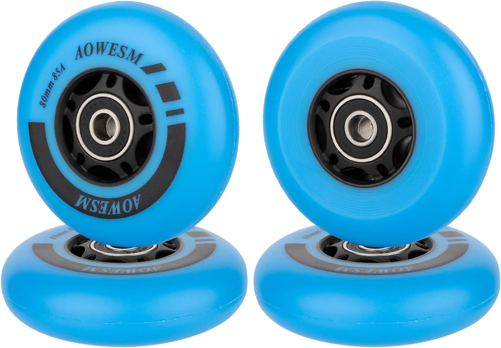
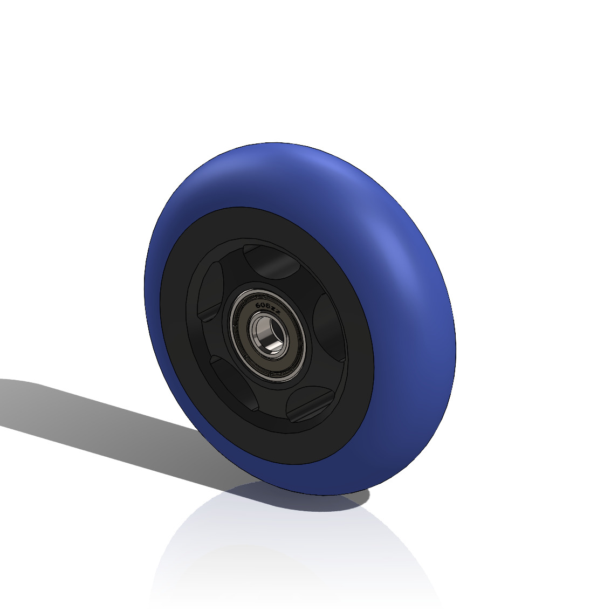

# Design
_The designs as of 2025 are working designs.  Working docs are for distributing robot modules between collaborators, but the designs may be pre-prototype and untested._

# Intentions
_Design intentions discussion here.  For the full design, the intent must be decided collaboratively.  For the design of modules, a respective expert can make initial targets & describe design intent in this section.

### Goals

> Key Goals for Design
>
> * Support low-cost, repeatable build from the ground-up in any global region.
> * Generate a minimal viable DDMR configuration for 10kg payload
> * Fully modular design: every part belongs to a subassembly which has utility or testable goals independent of the full robot
> * Minimize custom parts: The robot is a custom design but the parts should be standard, as much as possible
> * Commonization:  Aim to match SCUTTLE original modules in design details for: Selection of hardware, wiring configuration, etc.
> * Outsourced Data: for each module and each part, we use well-documented selections, and design choices backed by ubiquitous data.
> * Ownership of design: each module can be traced to an "owner" who fully understands the module & can produce documentation
> 

### Resources
_resources for designers arriving to help_

* [SCUTTLE Tech Guide](https://qr.net/scuttleproject) _a github-based webpage for scuttle designs_
* [SCUTTLE Miniguides](https://scuttlerobot.org/resources) _design & eval data on scuttlerobot.org website_
* [Youtube playlist](https://www.youtube.com/playlist?list=PLHkrnCQ5sDmdyelgZAIN76-Y_Tug1E4Ug) _playlist of videos related to scuttle robot, by D. Malawey_

### Glossary

* DDMR: differential drive mobile robot
* ownership: responsibility for producing professional explanatiosn for each decision in an item.

## Chassis
_Descriptions for parts, construction, key tolerances, assembly, and design intent for each module.

### Frame
The aluminum rectangular frame, and DIN rail mounting configuration.

### Wheel Assembly
Design for wheel module with wheel, bearings, shaft, pulley, motor, and belt as needed.

### Prints
Special notes for printed parts

### Unique parts
Discussion of parts that differ from a downscaled version of SCUTTLE Original design.

## BOM
Parts list

_Suggested materials copied from BOM spreadsheet, updated 2025.02.24_

| Item         | Product                                                                                                                |
| ------------ | ---------------------------------------------------------------------------------------------------------------------- |
| Extrusion    | [10pcs 1m amazon](https://www.amazon.com/Aluminum-Extrusion-European-Standard-Anodized/dp/B08PQPK379)                  |
| Wheels       | skate wheels 70mm, Amazon                                                                                              |
| Motor Driver | [4pcs L298N Amazon](https://www.amazon.com/HiLetgo-Controller-Stepper-H-Bridge-Mega2560/dp/B07BK1QL5T)                 |
| Encoders     | [AS5600 10-bit Encoder, Amazon](https://www.amazon.com/Magnetic-Encoder-Induction-Measurement-Precision/dp/B097QNG1CN) |
| Motors       | [10pcs gearmotor 113RPM Amazon](https://www.amazon.com/DC-Gear-Motor-Planetary-Industrial/dp/B07XMFLSPB)               |
| Connectors   | [75pcs lever wire connectors](https://www.amazon.com/dp/B08HXXWLT8)                                                    |
| Camera       | [arducam 5mp](https://www.amazon.com/Arducam-Megapixels-Sensor-OV5647-Raspberry/dp/B012V1HEP4)                         |
| Battery      | [LiPo 4pack Amazon](https://www.amazon.com/Tattu-Packs-450mAh-7-4V-Battery/dp/B07K18DJG5)                              |
| Fasteners    | [M5 drop in nuts](https://www.amazon.com/Fastener-Nickel-Plated-Sliding-Aluminum-Profile/dp/B086MKNYDS)                |
| DIN rail     | [10pcs 1m amazon](https://www.amazon.com/Aluminum-Professionals-Hardware-Components-Mounting/dp/B088FFHCDC)            |
| Corners      | [20sets M5 corner brkt](https://www.amazon.com/Aluminum-Profile-Connector-Bracket-Accessories/dp/B0855V2JV3)           |
| casters      | [50pcs blue caster amazon](https://www.amazon.com/dp/B07D2GWL2T)                                                       |
| belts        | [timing belt GT2, 10pcs, amazon](https://www.amazon.com/3Dman-Timing-Closed-Rubber-Printer/dp/B07V6N32B1)              |
| pulley       | [aluminum pulley GT2x16, amazon](https://www.amazon.com/Saiper-Aluminum-Synchronous-Compatible-Printer/dp/B07M9FT3H1)  |
| 3D Parts     | Filament, 1kg, amazon                                                                                                  |
| CPU          | [ESP8266, amazon](https://www.amazon.com/HiLetgo-Internet-Development-Wireless-Micropython/dp/B081CSJV2V)              |

### Wheels

Recommended wheels are sourced from inline-skate type wheels.  
* Example parts on amazon: [skate wheels](https://www.amazon.com/dp/B08CT98HFB)
* Diameter is 80mm, one of the most common standards.  This is about 3/4 diameter of original scuttle
* Clean CAD model on grabCAD: [grabcad skate wheel](https://grabcad.com/library/skatewheel-1)
  
- 
- 
