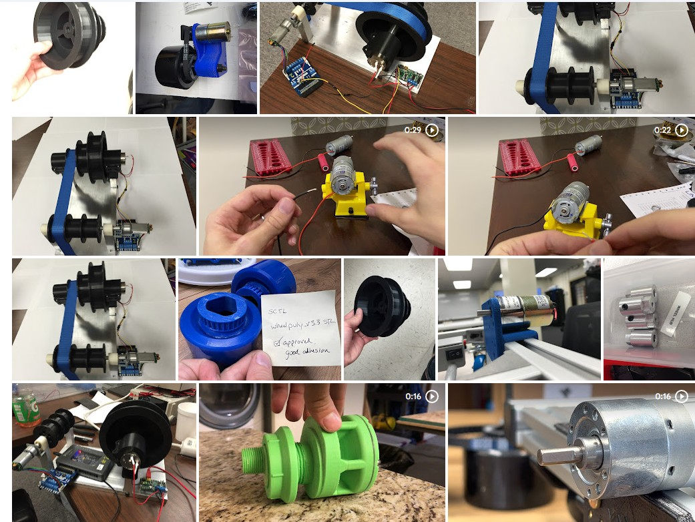

_goals for the SCUTTLE mini project and evaluation data will be posted on this page!_

## Drivetrain
As of 2025.05, our collaborator Niki from Malaysia is building the first drivetrain with the new scuttle-mini components.  Here are some performance items that must be validated:
* does the drivetrain operate without slipping of the belt & pulleys?
* how much torque can be delivered at each wheel?
* aluminum pulleys often wear on the motor shaft & slip free from the shaft, due to vibrations at the set screw.  What conditions lead to loosening wheel pulleys and what countermeasures are necessary to guarantee robust performance?

