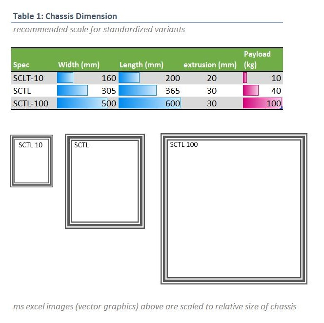

## SCUTTLE Mini
A temporary repository for the year 2025 for collaborating and advancing the scuttle mini project from concept to prototype.

>
> Join the Discord!
> If you wish to find other developers of SCUTTLE Mini, join the community by David Malawey with several open projects like OpenLab, SCUTTLE, and more!
> [CLICK HERE](https://discord.gg/Napn9mhd43) to join :smile:
>

## Contents
_This repo is a space to keep key content for designs, and retain background information as we create worthwhile steps.  If the project is not completed this year, we can retain and continue building on the progress made this year._

Designs are to include:
* Circuits (diagrams)
* Printed Parts (CAD models)
* OTS Parts (CAD, specifications, vendors, manufacturers)
* Wiring Diagrams (source files, such as PPTX or vector designs in draw.io)
* Power system (computations of power inputs and loads)
* Functional modules (configuration of assembled modules such as wheel with motor, bearings, bracket, and test results)
* Issues (documented issues that are measured and expected to require engineering).

## Overview

The suggested design for our first builders, is to carryover all useful components from standard scuttle.   For a smaller chassis, 20mm extrusion is a great solution, and the recommended sizes are shown below with the mini and the "mega"

For wheels, we recommend those from inline skates for durability and matching wheel bearings to the original design.  They are available around the world, affordable, and standard.  Design any pulley that you wish and bond it with CA glue to the urethane portion of the wheel.  (it's not recommended to attempt fasteners, and modeling fine details into the wheel-facing pulley side.)

## Projects++
>
> More open source designs:
>
> | Project | Link | Purpose | 
> | --------------- | ---------------------- | -------------------------------------------------------- | 
> | OpenAir | [qr.net/openairproject](https://qr.net/openairproject) | take control of air, pressure, & flow with open elements | 
> | OpenArm | [qr.net/openarmproject](https://qr.net/openarmproject) | revolutionize robotic arms, a 10-year goal | 
> | OpenBox | [qr.net/openboxproject](https://qr.net/openboxproject) | array of open designs beginning with a steel box | 
> | OpenGrow | [qr.net/opengrowproject](https://qr.net/opengrowproject) | open designs for hydroponics & aquaponics systems | 
> | OpenJar | [qr.net/openjarproject](https://qr.net/openjarproject) | array of designs for standard jars, threads, & seals | 
> | OpenLab | [qr.net/openlabproject](https://qr.net/openlabproject) | build a laboratory to design & fabricate anything. |
> | openME | [qr.net/openmeproject](https://qr.net/openmeproject) | a Mechanical Engineering degree, comprehensive & free, in-progress | 
> | OpenSpin | [qr.net/openspinproject](https://qr.net/openspinproject) | array of designs based on parametric bearings | 
> | SCUTTLE_Nigeria | [qr.net/scuttleafrica](https://qr.net/scuttleafrica) | university-level robotics lab in Lagos, Nigeria |
>
