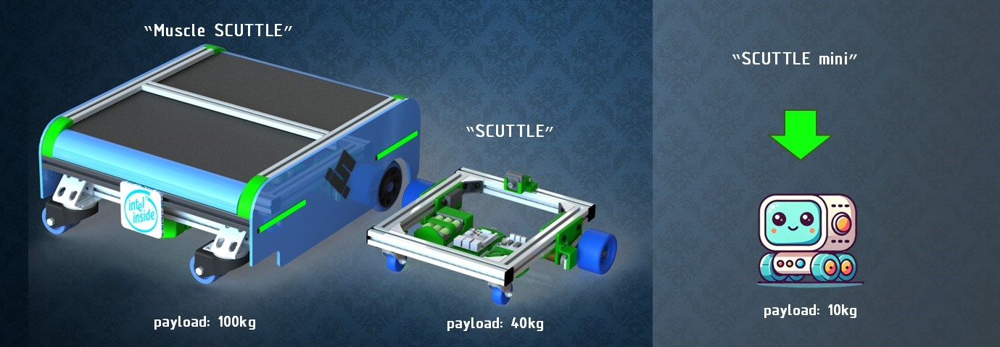
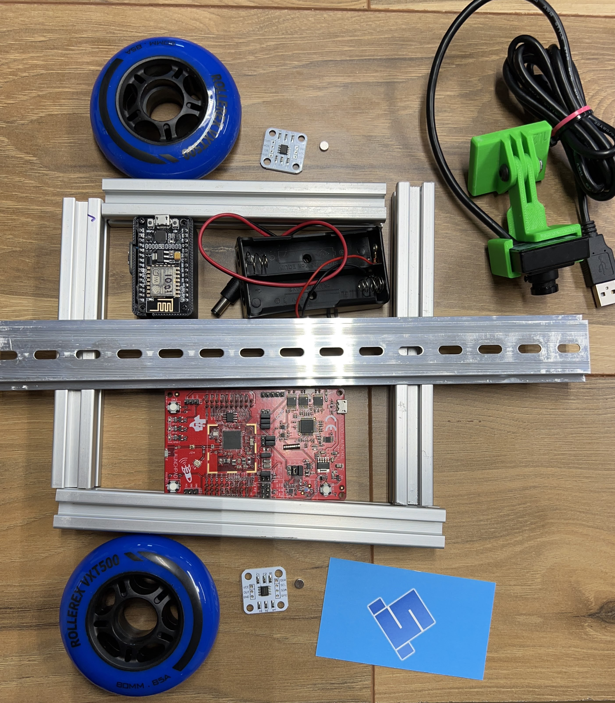

## SCUTTLE Mini
A temporary repository for the year 2025 for collaborating and advancing the scuttle mini project from concept to prototype.

## Contents
_This repo is a space to keep key content for designs, and retain background information as we create worthwhile steps.  If the project is not completed this year, we can retain and continue building on the progress made this year._

Designs are to include:
* Circuits (diagrams)
* Printed Parts (CAD models)
* OTS Parts (CAD, specifications, vendors, manufacturers)
* Wiring Diagrams (source files, such as PPTX or vector designs in draw.io)
* Power system (computations of power inputs and loads)
* Functional modules (configuration of assembled modules such as wheel with motor, bearings, bracket, and test results)
* Issues (documented issues that are measured and expected to require engineering).

